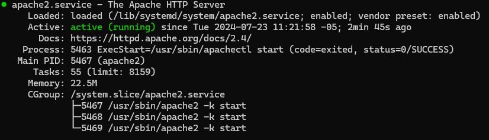

# Apache2

## Instalación

- Iniciamos la instalación moviendonos al directorio de usuario:

```bash
cd ~
```

- Se recomienda la realización antes de un update y upgrade:

```bash
sudo apt update
```

```bash
sudo apt upgrade
```

- Continuamos con la instalación por medio del comando:

```bash
sudo apt install apache2
```

- Activamos los módulos mod_ssl y mod_headers por medio del comando a2enmod:

```bash
sudo a2enmod rewrite headers ssl
```

- Seguidamnete se activa el soporte para el puerto SSL:

```bash
sudo a2ensite default-ssl.conf
```

- Reiniciamos Apache:

```bash
sudo service apache2 restart
```

- Finalizamos con la instalación de paquetes útiles para el entorno:

```bash
sudo apt install curl zip unzip openssl git wget
```

- Podemos revisar el estado de Apache con el siguiente comando:

```bash
sudo service apache2 status
```

- Y debemos obtener algo como lo que muestra la siguiente imagen:



## Configuraciones generales

- Para la configuración de apache vamos a la carpeta de Apache:

```bash
cd /etc/apache2/
```

- Creamos un respaldo de la configuración por defecto de apache:

```bash
cp apache2.conf apache2.conf.bk
```

- Abrimos el archivo de configuración para permitir el .htaccess:

```bash
sudo nano apache2.conf
```

- Y buscamos la configuración de Directory en el apartado /var/www/, en donde reemplazamos **AllowOverride None** por **AllowOverride All**, guardamos el archivo y reiniciamos el servidor Apache:

```bash
## Luego de moficar apache2.conf
sudo service apache2 restart
```

- Continuamos con:

[Instalación de PHP](./content/PHP.md){ .md-button }
